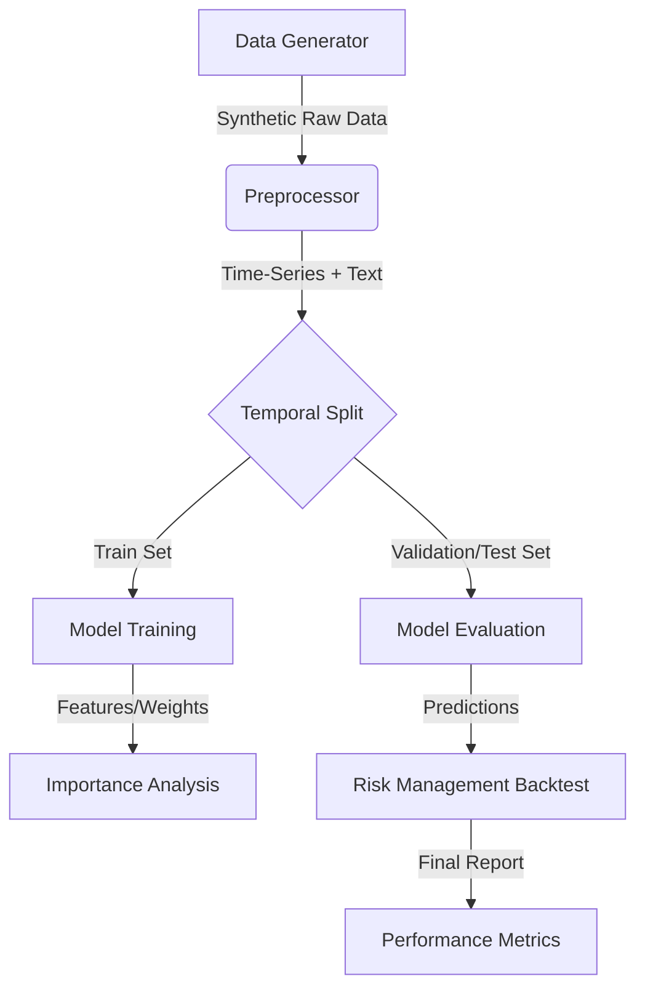

# Financial Market Volatility Predictor

A comprehensive machine learning pipeline designed to forecast financial market volatility using both quantitative time-series data and qualitative news sentiment analysis. This project emphasizes **data integrity**, **leakage prevention**, and **robust risk management**.

## Pipeline Architecture

The pipeline processes raw market data and news headlines through a structured sequence, ensuring no information flows from the future into the past during training.



## Features

- **Robust Preprocessing**: Outlier capping at 1st/99th percentiles using training-only distributions.
- **Leakage Prevention**: Strict temporal train-validation-test splitting.
- **Multi-Modal Modeling**: Compare Time-Series only, NLP-only, and Combined models.
- **Risk Management**: Backtesting module that reduces exposure when high volatility is predicted, mitigating drawdowns.
- **Terminal Visualization**: ASCII-based ROC curve and clean console reporting.

## Installation

Ensure you have Python 3.8+ installed.

```bash
cd finana
pip install -r requirements.txt
```

## Usage

Run the entire pipeline to train models and simulate a trading backtest:

```bash
# Using the default Random Forest model
python3 src/main.py

# Using Gradient Boosting
python3 src/main.py --model gradient_boosting
```

## Running Tests

Verify the integrity of the data generation, preprocessing, model fitting, and evaluation components:

```bash
python3 -m unittest tests/test_pipeline.py
```

## Project Structure

- `src/data_generator.py`: Generates synthetic data with embedded sentiment signals.
- `src/preprocessor.py`: Handles feature engineering, vectorization, and temporal splitting.
- `src/models.py`: Defines the predictive ML models and feature importance extraction.
- `src/evaluator.py`: Handles metric calculation and risk management backtesting.
- `src/main.py`: The main entry point orchestrating the workflow.
- `tests/test_pipeline.py`: Comprehensive unit test suite.
