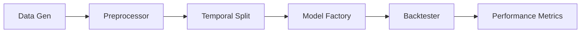

# Finana: Financial Volatility Forecasting

A professional-grade machine learning pipeline for predicting next-day financial market volatility by combining quantitative time-series data with qualitative news sentiment analysis.

## Key Features
- **Multi-Modal Learning**: Seamlessly blends stock price dynamics (OHLCV) with NLP features (TF-IDF or LLM Sentiment).
- **Configuration-First**: Manage models, API keys, and cloud settings via `config.toml`.
- **Leakage-Free**: Strict temporal splitting ensures no look-ahead bias during training.
- **Custom Model Injection**: Support for any scikit-learn compatible estimator.
- **Backtesting Suite**: Simulates risk-managed portfolio performance based on volatility signals.

## Installation
```bash
git clone <repo_url>
cd finana
python3 -m venv venv
source venv/bin/activate
pip install -r requirements.txt
```

## Quick Start
1. **Run with defaults**:
   ```bash
   python3 src/main.py
   ```
2. **Configure your own setup**:
   Edit `config.toml` to switch models or enable Cloud LLM features:
   ```toml
   [cloud_settings]
   enabled = true
   api_key = "sk-..."
   
   [model_settings]
   model_type = "gradient_boosting"
   ```

## Architecture


## Custom Model Usage
```python
from sklearn.svm import SVC
from src.models import VolatilityPredictor

# Inject your custom model into the pipeline wrapper
predictor = VolatilityPredictor(model=SVC(probability=True))
predictor.fit(X_train, y_train, metadata=meta)
```

## Developer Notes
- **Outlier Handling**: Robust scaling and percentile capping prevent extreme market moves from biasing the model.
- **Memory Optimization**: Vectorized pandas operations and sparse-matrix handling in TF-IDF ensure fast runtimes on local machines.
